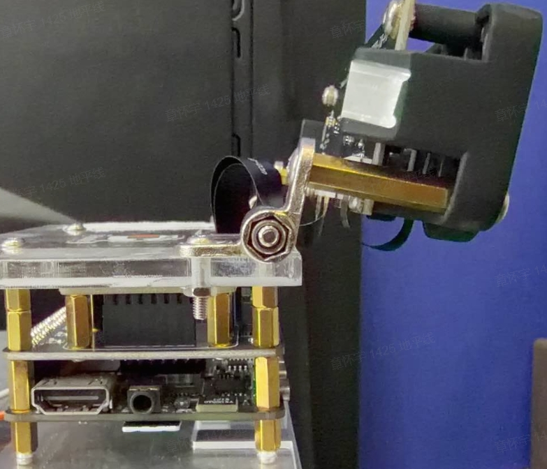
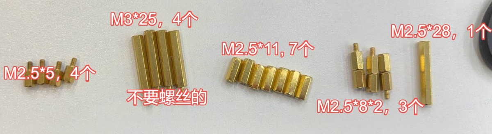
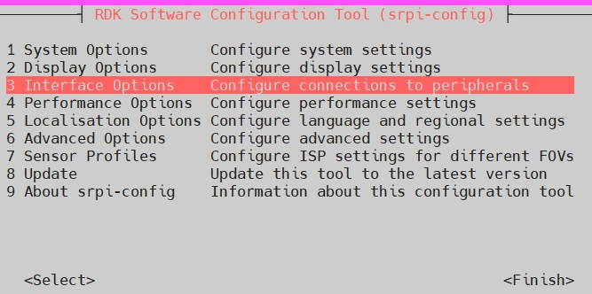
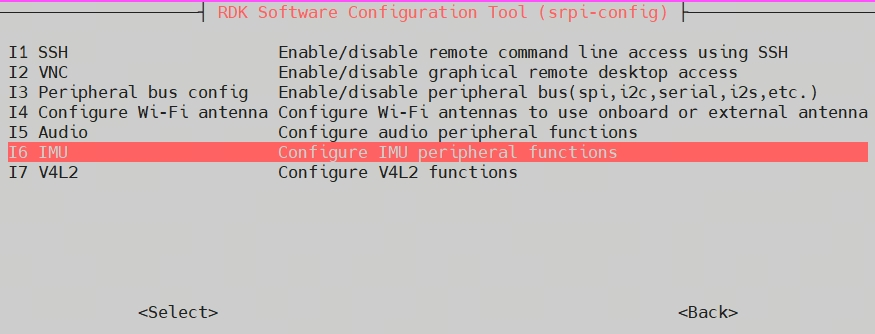
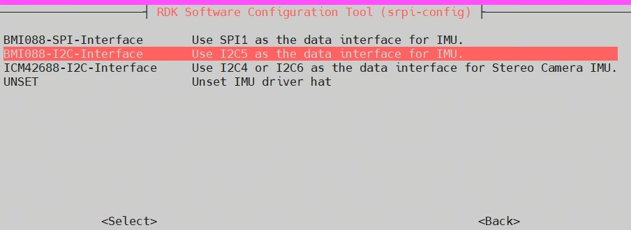
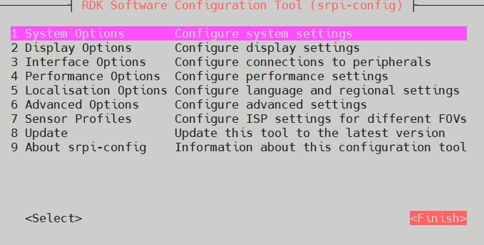
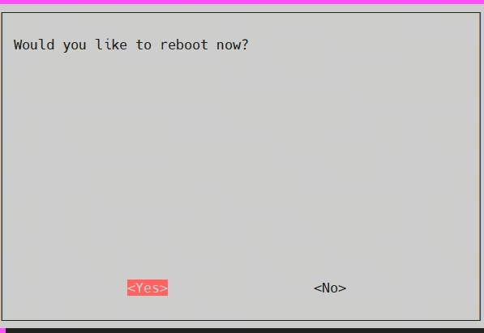

Getting Started with IMU Sensor Node
# Intro
The imu_sensor package is used to publish sensor_msgs::msg::imu ROS2 topic, which includes angular velocity and linear acceleration of object motion with fine-tuned timestamps.
This article details how to compile and use the imu_sensor package.

The sensors must be securely fastened to prevent any relative movement which causes extrinsic parameters changes during operation.
As shown in the figure below, the sensors are mounted securely to a rigid mounting structure.

It's need use these pillar to install the IMU sensor as shown below.


# Build
## Dependency
dependency libraries：
ros2 package：
- sensor_msgs
- rclcpp
## Developing Environment
- Language: C++
- Platform: X5
- Operating System: Ubuntu 22.04
- Compiling Toolchain: Linux GCC 11.2.0/Linaro GCC 11.2.0

## X5 environment configuration
ssh into X5, and set the interface of IMU.
```bash
srpi-config
```
After you input srpi-config, the terminal will show the configuration.
1. press '↓' of keyboard to select option 3 'Interface Options' and press Enter
   
2. press '↓' of keyboard to select option I6 'IMU' and press enter
   
3. press '↓' of keyboard to select option 'BMI088-I2C-Interface' and press Enter
   
4. press '→' of keyboard to select option '\<Finish\>' and press Enter
   
5. reboot now!
   

## Code dowaloading
```bash
mkdir -p ~/tros_nav/src
cd tros_nav/src
git clone -b feat-rdk-imu-V2 https://github.com/D-Robotics/hobot_imu_sensor.git
```
## Compiling
```bash
cd ~/tros_nav
colcon build
```
## Execution
```bash
cd ~/tros_nav

# launch imu and stereo camera
source /opt/tros/humble/setup.bash
source install/setup.bash

ros2 launch imu_sensor imu_sensor.launch.py imu_gravity:=9.795 imu_log_level:=warn
```
The imu message will be published under the topic name of `/drobotics_imu/bmi08x_imu`.
